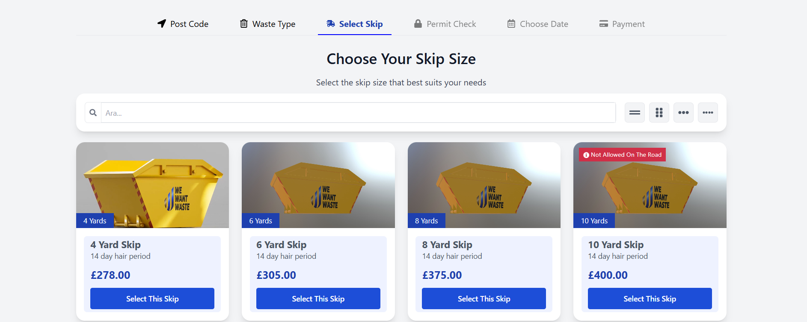

🚀 React + Vite + Tailwind V3 + Redux Thunk Template
This project is a minimal and modern starter template built with React, Vite, Tailwind CSS v3, and Redux Thunk. It provides a solid foundation for building fast, scalable, and maintainable frontend applications.

📸 Application Preview

🛠️ Technologies Used
- React
- Vite
- Tailwind CSS v3
- Redux
- Redux Thunk
- ESLint

⚙️ Getting Started
Follow the steps below to run the project locally:

1.Clone the repository:
git clone https://github.com/your-username/your-project.git
cd your-project

2.Install the dependencies:
npm install
 
3.Start the development server:
npm run dev

4.Open http://localhost:5173 to view the app in the browser.

🧱 Project Structure
├── public/
│   └── screenshots/
├── src/
|   ├── assets/
│   ├── components/
│   ├── helpers/
│   ├── pages/
│   ├── routes/
│   ├── store/
│   └── App.jsx
├── tailwind.config.js
├── vite.config.js
└── README.md

🧠 Development Approach
- Built with modular and scalable architecture in mind.
- Used Redux for global state management and Redux Thunk for handling async actions.
- Integrated Tailwind CSS for utility-first and responsive styling.
- Leveraged Vite for lightning-fast development experience.
- Added basic ESLint rules for consistent code style and potential error prevention.

🧩 Additional Notes
All screenshots and preview assets are stored in public/screenshots/.

📄 License
This project is licensed under the MIT License.

 